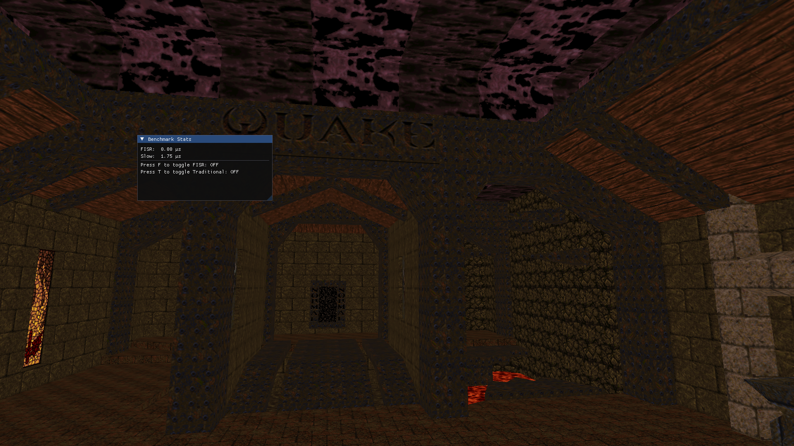

# opengl-quake

A simple Quake map viewer in OpenGL originally made by Johan Gardhage and further improved by Bruno Hayek.

The main goal for this fork is to render the Quake map viewer using the Fast Inverse Square Root, a traditional calculation method or a Taylor series approximation. More details are give in the following repository: https://github.com/BrunoEAH/FISR-3D-Rendering. We have further improved the building file so that it also generates a executable for Windows. In the end, we adapted the code to C++20 and also added a window to see the benchmark for each calculation method.

Github com o nosso fork:
https://github.com/BrunoEAH/opengl-quake-FISR-Experiment





## Prerequisites

To build opengl-quake, you must first install the following tools:

- [SDL 2.0.4](https://www.libsdl.org/download-2.0.php) (or later)
- [GLU](https://en.wikipedia.org/wiki/OpenGL_Utility_Library)
- [Ninja 1.5](https://ninja-build.org/) (or later)
- C++20

We also used ImGUI (https://github.com/ocornut/imgui), but its files are located in the third_party folder.

### Install dependencies

#### openSUSE

`$ sudo zypper install ninja gcc-c++ libSDL2-devel glu-devel`

#### Ubuntu

`$ sudo apt install ninja-build g++ libsdl2-dev libglu1-mesa-dev`

## Build instructions

To build the quake demo program, run:

`$ ninja`

A `build` directory will be created, containing the demo program.

## Usage

```
Usage: quake [OPTION]...

Options:
 -h, --help         Display this text and exit
 -w, --window       Render in a window
     --fullwindow   Render in a fullscreen window
 -f, --fullscreen   Render in fullscreen
 -c, --showcursor   Show mouse cursor
     --nocursor     Hide mouse cursor
Press F to turn on the FISR algorithm
Press T to turn on the traditional algorithm
```

## Sobre o código

Implementamos três métodos em World.cpp que podem ser utilizadas no cálculo da inversa de uma raiz quadrada:

World::Q_rsqrt -> Algoritmo FISR
World::very_slow_rsqrt -> Algoritmo usando aproximação por série de Taylor
1.0f / std::sqrt(x) -> Método tradicional

Esses métodos são chamados na função World::CalculateDistance(vec3_t a, vec3_t b), que calcula o produto escalar de dois vetores que serão normalizados. Nela há implementação de linhas que nos auxiliam a medir o benchmark, o qual é dado pelo cálculo do vetor por microsegundos. 

O tempo é calculado usando std::chrono::high_resolution_clock::now() , depois computa-se o valor em microsegundos com std::chrono::duration<float, micro>(end - start).count(); e é feita uma "suavização" do tempo, para deixar o benchmark mais estável.

Posteriormente, na função main de Quake.cpp cria-se uma janela utilizanda a interface gráfica para C++ ImGUI, em que será mostrado os dados de benchmark,
com o respectivo tipo de algoritmo usado para o cálculo e o tempo em micro segundos.

## License

Licensed under MIT license. See [LICENSE](LICENSE) for more information.

## Authors

* Johan Gardhage
* Bruno Hayek
* Gustavo Ciola
* Caio Alexandre de Andrade
* Nicolas Melnik
