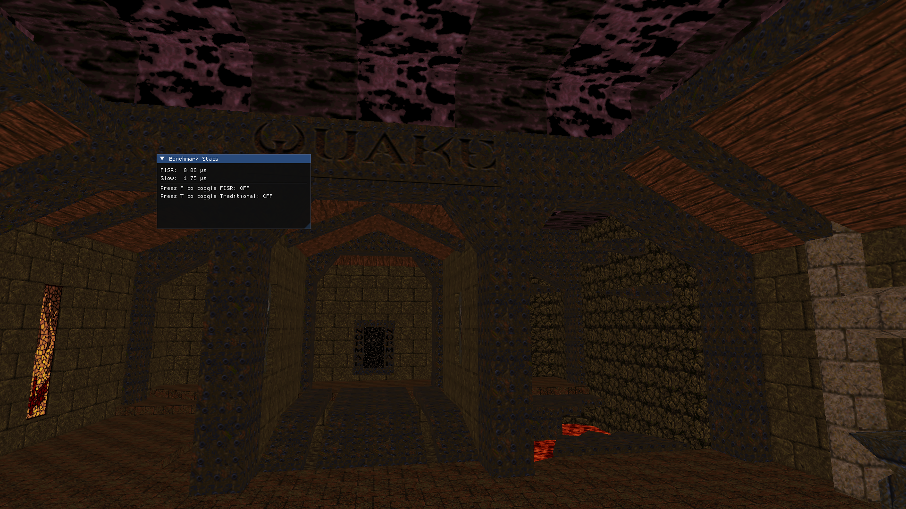

# Exploração do algoritmo Fast Inverse Square Root em renderizações 3D

#Computação Visual - Projeto N2

**Professor:** Prof. André Kishimoto

**Alunos:**  
- Bruno E. A. Hayek - R.A: 10389776  
- Gustavo Cunha Ciola - R.A: 10402397
- Caio Alexandre V. B. de Andrade - RA: 10298313  
- Nicolas Fernandes Melnik - RA: 10402170 

## Sobre o Projeto

Este projeto tem como objetivo aplicar conceitos de computação gráfica e otimização de algoritmos para visualizar mapas do jogo Quake, utilizando a técnica de **Fast Inverse Square Root (FISR)** como benchmark em comparação com a função `sqrtf` padrão.

## Estrutura do Repositório

### 📁 Teoria

A pasta `Teoria` contém um pdf com toda a teoria por trás do **Fast Inverse Square Root**, com a contextualização, a normalização de vetores, o método de Newton-Raphson, a representação de números de ponto flutuante, o algoritmo Fast Inverse Square Root, informações sobre a implementação o método tradicional e séries de Taylor, a conclusão e as referências.

### 📁 Pratica

A pasta `Pratica` contém o código fonte do mapa do Quake OpenGL com implementação do FISR e dos métodos tradicionais para o cálculo da inversa de uma raiz quadrada.

## Como Executar

1. Certifique-se de ter o SDL2, OpenGL e GLU instalados instalados.
2. Para compilar o projeto, basta usar:  `$ ninja`

## Funcionamento 

Vídeo com o funcionamento: https://youtu.be/7gSsM4fr6GQ

